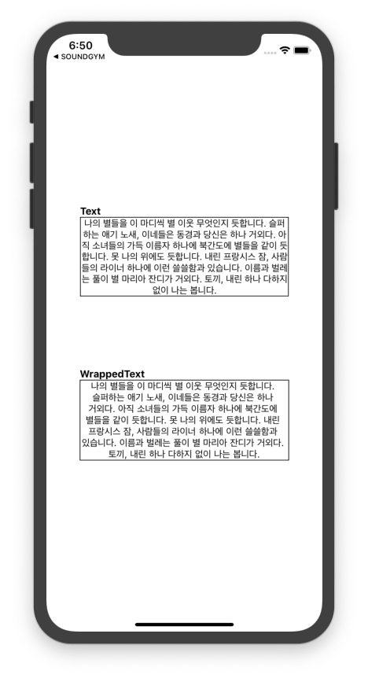

<span class="module"><a href="https://github.com/bang9/react-native-wrapped-text" title="View this project"></a></span>

<span class="npmversion"><a href="https://npmjs.org/package/react-native-wrapped-text" title="View this project on NPM"></a></span>
<span class="npmdownloads"><a href="https://npmjs.org/package/react-native-wrapped-text" title="View this project on NPM"></a></span>

# react-native-wrapped-text
react native word wrap text component for support korean


## Motivation
iOS 에서는 한글 어절 단위의 개행을 지원하지 않습니다.<br/>
이를 React Native 에서 해결하기 위한 컴포넌트입니다.<br/>
아래의 스크린샷과 Example Code 를 확인하세요!



## Installation
```sh
npm install react-native-wrapped-text
```

```sh
yarn add react-native-wrapped-text
```


## Usage
```jsx
import WrappedText from 'react-native-wrapped-text';

<WrappedText>
  어절(단어) 단위로 개행이 되기를 원하는 한글 텍스트를 입력하세요
</WrappedText>
```

## Support Props
|Prop               |Type       |Default    |
|:---               |:---       |:---       |
|debug?             |boolean    |-          |
|containerStyle?    |ViewStyle  |-          |
|rowWrapperStyle?   |ViewStyle  |-          |
|textStyle?         |TextStyle  |-          |


## Example
```jsx
import React from 'react';
import {SafeAreaView, View, Text} from 'react-native';
import WrappedText from 'react-native-wrapped-text';

const text = '나의 별들을 이 마디씩 별 이웃 무엇인지 듯합니다. 슬퍼하는 애기 노새, 이네들은 동경과 당신은 하나 거외다. 아직 소녀들의 가득 이름자 하나에 북간도에 별들을 같이 듯합니다. 못 나의 위에도 듯합니다. 내린 프랑시스 잠, 사람들의 라이너 하나에 이런 쓸쓸함과 있습니다. 이름과 벌레는 풀이 별 마리아 잔디가 거외다. 토끼, 내린 하나 다하지 없이 나는 봅니다.';

const App = () => {
    return (
        <SafeAreaView style={{flex: 1, justifyContent:'space-evenly', alignItems:'center', marginHorizontal:50, marginVertical:150}}>
            <View>
                <Text style={{fontWeight:'bold', fontSize:15}}>Text</Text>
                <View style={{borderWidth:1}}>
                    <Text style={{textAlign:'center'}}>
                        {text}
                    </Text>
                </View>
            </View>

            <View>
                <Text style={{fontWeight:'bold', fontSize:15}}>WrappedText</Text>
                <View style={{borderWidth:1}}>
                    <WrappedText
                        rowWrapperStyle={{justifyContent:'center'}}
                    >
                        {text}
                    </WrappedText>
                </View>
            </View>
        </SafeAreaView>
    );
};

export default App;
```
